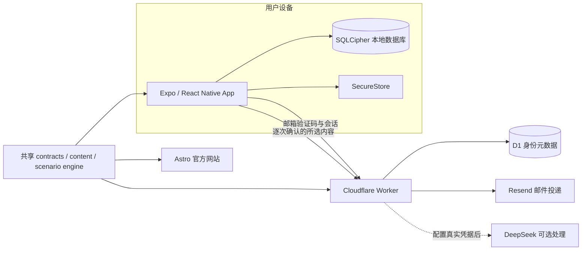

<p align="center">
  
</p>

# 内界 CAVE

**听见身体，确认边界。**

[](https://github.com/CarterWells111/CAVE/actions/workflows/ci.yml)

内界 CAVE 是一款面向成年女性的身体认知、亲密关系与自我边界成长应用。以内界手记为核心，通过可跳过的引导、后来与阶段回顾，帮助用户留意自己的感受和需要；系统旅程提供辅助探索。产品不替用户作决定，也不对“准备程度”评分。

[官方网站](https://neijiecave.com/) · [在线产品演示](https://neijiecave.com/demo/) · [内容来源](https://neijiecave.com/sources/) · [完整文档](docs/README.md)

## 产品体验

默认首页为旅程；底部依次为旅程、内界手记、AI、我的。内界手记支持一句话保存、账号隔离草稿恢复和修改历史。辅助探索包含从认识自己到形成表达的五页旅程：

1. 身体与安全知识
2. 过夜期待
3. 行为地图与边界
4. 你随时可以改变主意
5. 私密准备与沟通草稿

预设沟通练习是独立入口，也可以在完成旅程后带着沟通草稿进入，不计入五页进度。

手记无须先完成旅程。用户也可以把旅程卡片带入“内界手记”，继续记录事件日期、感受以及后来发生的变化。手记支持最近一周、一个月与自选日期回顾，原始记录和“后来”可以随时修改并保留旧版本。

当前移动端练习使用预设路径，不调用生成式 AI。预设练习支持暂停、改变主意和安全退出，所有态度并列呈现，不把亲密行为设计成升级路线。

## 隐私边界

- 核心旅程、练习、沟通卡和普通回顾无需登录。
- 手记需要邮箱验证码；手记登录只用于同一设备上的账号隔离。
- 旅程、卡片、手记和反思保存在本机，不上传到身份服务，也不提供云同步。
- 原生构建配置使用 SQLCipher 保存本地数据库，并用 SecureStore 保存数据库密钥和刷新令牌。
- AI 仅在逐次预览和确认后处理所选内容；支持本机模拟与真实 DeepSeek；服务端真实问答已验证，手机及其他场景仍需验收。
- Expo Go 将手记、草稿、后来和阶段回顾保存在账号隔离的明文 SQLite；其他旅程运行数据使用内存，不代表原生加密已经得到设备验证。
- 删除云端账号与删除本机内容是两个独立、明确的操作。

更多说明见[数据分类](docs/architecture/data-classification.md)、[威胁模型](docs/architecture/threat-model.md)和[当前限制](docs/product/current-limitations.md)。

## 技术架构



私密正文不会随登录请求离开设备。可选 AI 动作通过独立鉴权接口处理当前或选定的记录；服务端不保存手记正文，结果由用户确认采用。真实服务商数据政策须在启用前核实。

主要技术包括 Expo SDK 57、React Native、Expo Router、TypeScript、SQLCipher、SecureStore、Cloudflare Workers、D1、Hono、Astro、Zod、Jest 和 Vitest。

## 仓库结构

```text
apps/
  mobile/             Expo 移动应用
  gateway/            Cloudflare Worker：邮箱身份与独立安全网关
  web/                Astro 官方网站与产品演示页
packages/
  contracts/          跨端请求、响应与领域契约
  content/            结构化课程、场景与来源元数据
  scenario-engine/    确定性的练习状态机
  test-fixtures/      共用测试数据
docs/                 产品、架构、开发与运维文档
tests/                仓库级 CI、安全和文档契约测试
```

## 本地运行

环境要求：Node.js `^22.12.0` 或 `>=24 <25`，Corepack，以及可运行 Expo SDK 57 的 iOS/Android 环境。

```bash
corepack enable
corepack pnpm install --frozen-lockfile
```

分别启动移动端、官网或 Gateway：

```bash
corepack pnpm dev:mobile
corepack pnpm dev:web
corepack pnpm dev:gateway
```

移动端核心旅程不依赖 Gateway。邮箱验证码需要额外的本地 Worker、D1 和邮件配置，详见[开发环境](docs/development/setup.md)与[邮箱身份运维](docs/operations/email-authentication.md)。

## 验证

```bash
corepack pnpm typecheck
corepack pnpm lint
corepack pnpm test
corepack pnpm validate:content:internal
corepack pnpm build:gateway
corepack pnpm build:web
```

生产内容校验会继续拒绝尚未完成专家复核的内容；内部演示校验通过不等于医学或性教育专家认可。各命令的边界见[验证指南](docs/development/verification.md)。

## 项目状态

内界 CAVE 在四天黑客松中完成了从移动端体验、本地数据层、邮箱身份后端到官方网站的首个纵向闭环。当前版本仍是持续完善中的原型，不提供医疗诊断、法律意见、危机干预或跨设备数据恢复。已知限制与后续方向记录在[当前限制](docs/product/current-limitations.md)。
