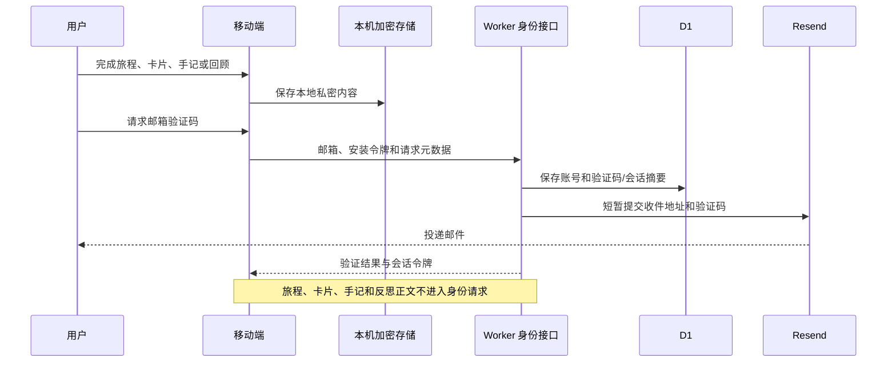

# 技术架构

内界 CAVE 使用 pnpm workspace 管理移动端、边缘服务、官方网站和共享领域包。亲密内容默认留在设备内；远程身份服务只获得必要身份元数据。仅用户逐次确认的 AI 请求会将所选内容发送至独立 AI 接口。

## 系统组成

| 模块 | 技术 | 职责 |
| --- | --- | --- |
| 移动端 | Expo SDK 57、React Native、Expo Router | 手记、回顾、辅助旅程、预设练习和可选 AI 界面 |
| 本地数据层 | Expo SQLite/SQLCipher、SecureStore | 私密数据、数据库密钥、成年声明、刷新令牌和本机资料 |
| Gateway | Cloudflare Workers、Hono、Zod | 邮箱验证码、会话、账号删除，以及独立的安全网关研究 |
| 身份数据 | Cloudflare D1 | 账号 UUID、不可逆摘要、过期时间、限流与删除授权 |
| 邮件 | Resend | 用户主动请求的验证码投递 |
| 官网 | Astro | 产品介绍、演示、隐私、安全、支持和来源页面 |
| 共享包 | TypeScript、Zod | 跨端契约、结构化内容、确定性场景引擎和测试数据 |

## 当前数据流

核心旅程完全可以离线使用。登录只参与手记入口、本机账号隔离和账户管理，不改变私密内容的存储位置。

## 本地持久化

原生构建把旅程草稿、卡片、版本历史和手记放入 SQLCipher 数据库，把数据库密钥和少量设备级状态放入 SecureStore。数据库初始化先设置密钥，再读取 schema；迁移使用连续、只向前的版本注册表和独占事务。

如果密钥、数据库或 schema 状态不一致，应用进入明确的恢复状态，不自动删除剩余资料，也不静默创建空数据库。删除全部本机数据时，系统先写入不含正文的待删除标记，再清除数据库、WAL/SHM、密钥、安装令牌和本机会话；启动时会继续未完成的删除。

Expo Go 手记使用账号隔离的明文 SQLite（含草稿和修改历史），其他旅程运行数据使用内存。它是功能预览环境，不属于原生 SQLCipher 加密证明。

## 身份服务

邮箱验证码为 6 位，10 分钟有效，最多尝试 5 次，并分别按邮箱摘要和安装令牌限流。Access Token 有效 15 分钟且只驻留移动端内存；Refresh Token 有效 30 天，原文保存在 SecureStore，D1 仅保存摘要并在刷新时进行条件轮换。

D1 不保存原始邮箱、验证码、访问令牌、刷新令牌或任何本地私密内容。Resend 在邮件投递期间会处理收件地址和验证码，其数据处理同时受 Resend 服务条款约束。

## AI gateway 边界

移动端预设练习不调用 AI 练习接口。可选手记/旅程 AI 使用 POST /v1/assistant，经现有访问令牌鉴权和账号限流后处理所选内容。请求严格限长，模型仅由服务端调用；输出经过结构、来源和安全检查，超时失败不阻塞本机保存。

每次请求先预览与确认，不持久化全局读取许可。修改内容或切换账号会使旧结果失效；取消等待无法撤回已经发出的数据。Gateway 不存储或记录手记正文。已接通真实 DeepSeek 并验证固定旅程问答；提供方数据保留政策仍需在正式发布前核实。
